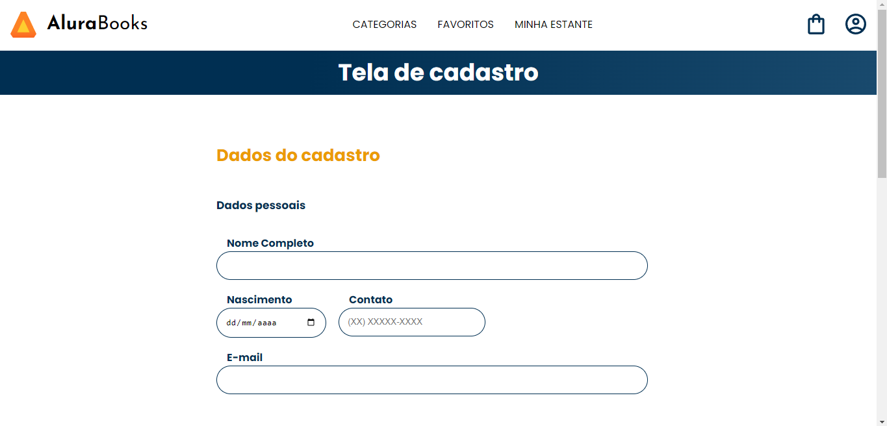

# Alura - Consumindo Dados API

Course provided by **Alura**, which has **Mônica Mazzochi Hillman** as an instructor, 
[Course Link](https://cursos.alura.com.br/course/javascript-criando-requisicoes)

## Site Preview

## Differences between my code

- Features implementations
  - This happens because I do all the code on my own, and of course, I have been influenced sometimes by the instructor,
      but overall, My code is different.

## Major Knowledge 

In this course, I studied how to connect with API's using get requisitions and how to do post requisitions, and I've learned about Promisses and Async Events in Js too.

### Used tecnhologgies

1. HTML
2. CSS
3. JavaScript
4. [ViaCep API](https://viacep.com.br/)
